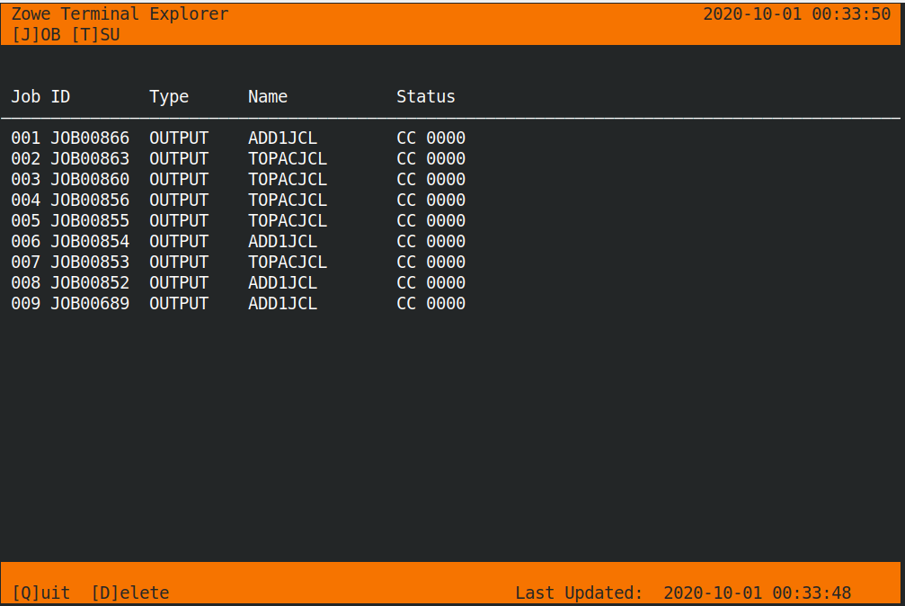
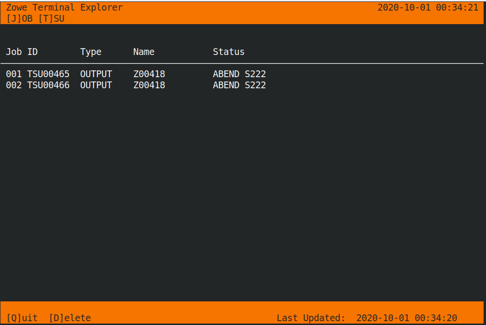

# Zowe Terminal Explorer

Written for the IBM Master The Mainframe 2000, this is a quick tool that allows you to monitor the jobs list and delete those jobs no longer required.  




## Installation

Tested only on a Linux machine.

```
git clone https://github.com/tommccallum/zowe-terminal-explorer
./zte
```

## Actions

| Key | Action | 
|-----|--------|
| q   | Quits application |
| d   | Delete job |
| j   | Switch to jobs if available |
| t   | Switch to tsu jobs if available |


## Known Bugs

1. When the display changes sometimes the background colour disappears.
2. When the display resizes very small or the application is open in too small a window, the application will throw an exception.

In either case, restart the application in the appropriately sized terminal.
